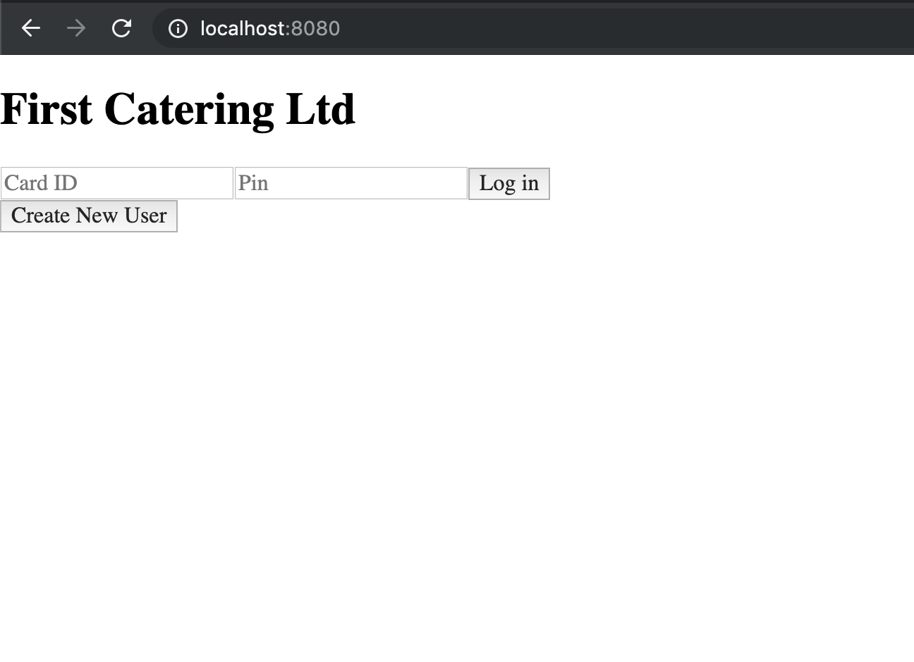
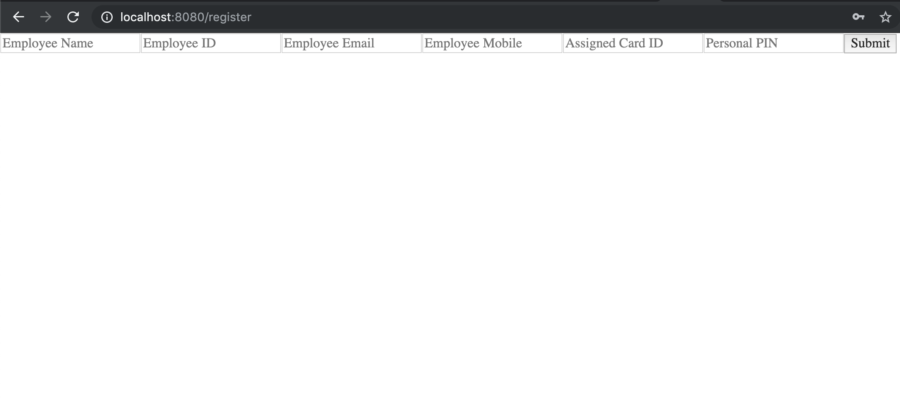
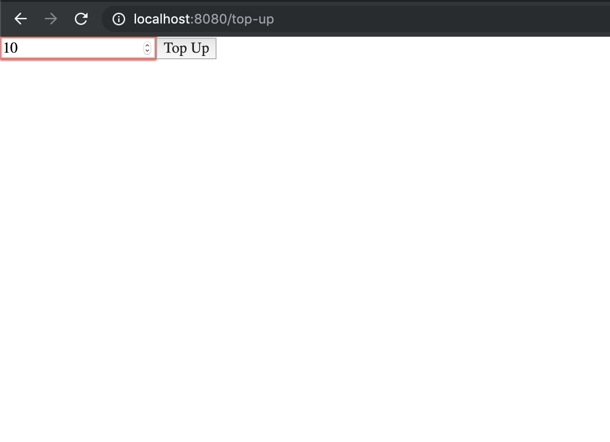
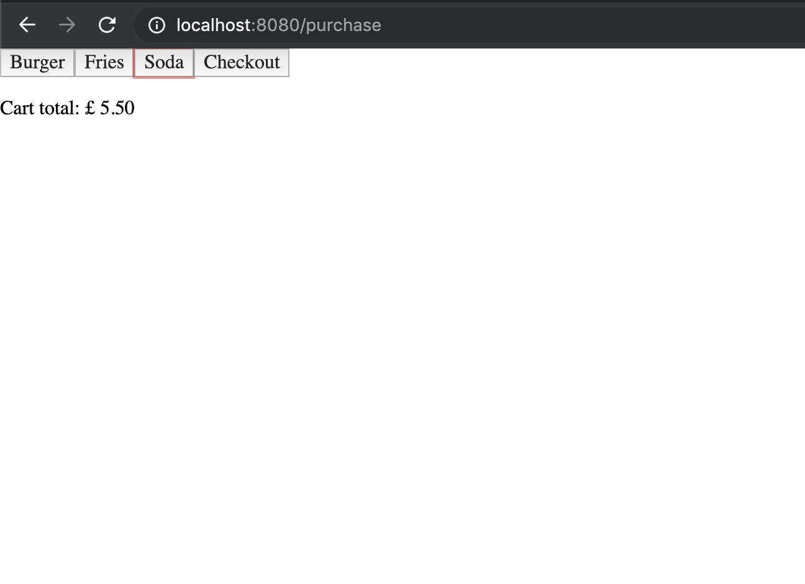
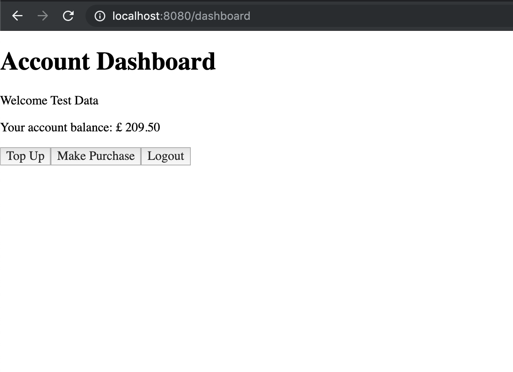

# Synoptic Project - Membership System

## Installation
Clone repository and cd into project.

Use the package manager [npm](https://www.npmjs.com/) to install the required modules for ***both*** `client` and `server`.

```bash
npm install
```

## Config
All the neccessary config information is contained in the [.env file](https://github.com/Max-Stevenson/synoptic-project/blob/master/server/.env). This profile has only been committed for the sake of having the program connect to the database and run locally when evaluated as part of the synoptic project.

## Running
1. From within the `server` directory run:
```bash
npm run dev
```
2. From within the `client` directory run:
```bash
webpack-dev-server
```
3. Either navigate to <http://localhost:8080/> to experience the front-end client, or use [Postman](https://www.getpostman.com/) to make requests directly to the API.
Refer to the [API Guide](https://github.com/Max-Stevenson/synoptic-project/blob/master/API%20Guide.md) for further info.

## Example Operation:

This is the screen the user is greeted with upon visting <http://localhost:8080/>.


This shows the user sign up screen.


Following a successful login the user will be met with this page showing key account details.


A user can use this screen to topup their account balance, before being automatically redirected to their dashboard.


The new accountBalance is visible in the dashboard.


A user can purchase food and drink, with the total amount being put in a cart before checkout.


Having made a purchase the deducted total is taken from the accountBalance and the new balance visible again in the dashboard.

## Technology
To build this project I used the following tech stack:

### Client
- [React](https://reactjs.org/)
- [Redux](https://redux.js.org/)

### Server
- [Node.js](https://nodejs.org/en/)
- [Express](https://expressjs.com/)
- [mongoose](https://mongoosejs.com/)

### Database
- [MongoDB Atlas](https://www.mongodb.com/cloud/atlas)
