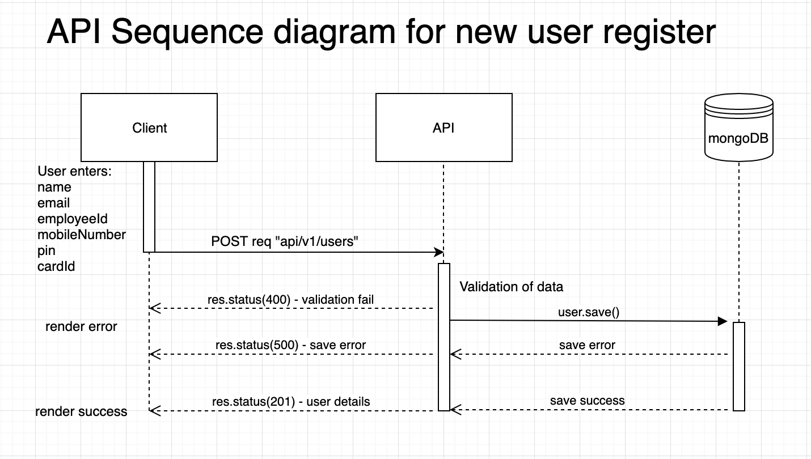
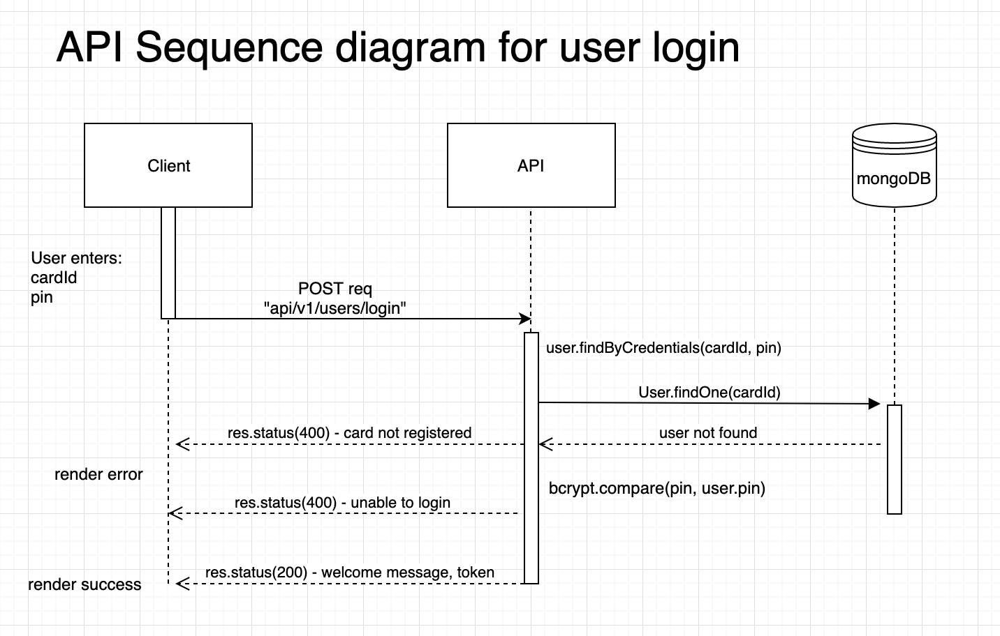
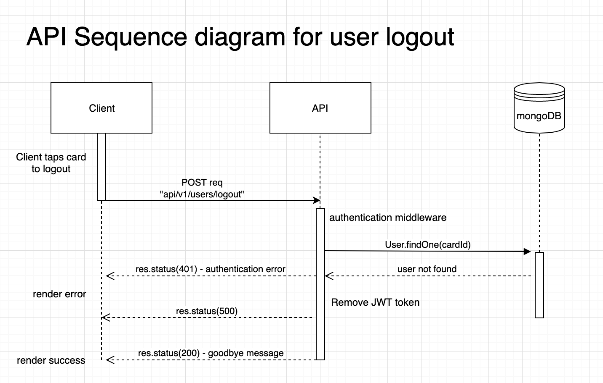
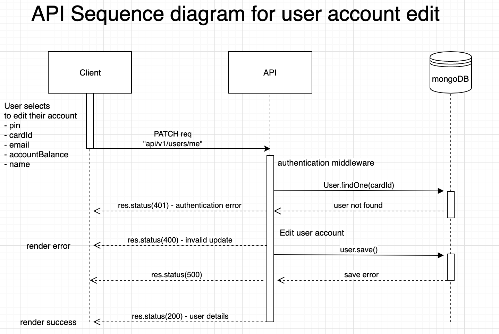

# Design of Membership System

## Requirement Assumptions
- Hypothetical First Catering Ltd will be able to modify their front-end service to construct API requests.
- Additional API routes created for actions not specified in requirements document.
  - view user account - reasonable assumption that users may want to know their balance before Topping up.
  - edit account details - reasonable assumption a user may be required to change their personal details.


## API design v2.0
After initial designs were implemented I decided to extract the process of interacting with a user's accountBalance to a separate route.
It didn't make sense for a user to be able to directly manipulate their balance.
- register new user
> If the card is not registered on the system, the owner will be rquired to provide basic employee information.
- login
> When a card is presented to the system and the service finds that the card is already registered,
the system will show a welcome message wit hthe user's name associated with the card.
- logout
> It is envisaged that when the user taps their card a second time the system informs the user and says "Goodbye".
- ~~top up~~
- ~~pay~~
- edit balance
> ... will allow Bows Formula One employees to use their existing data cards in the kiosks to register and top up with money.
>
> ... shall be able to use their existing employee cards to top up and purchase food at their existing kiosk terminals.

## API Sequence diagrams









## API Design v1.0
Essential routes required to meet basic specifications:
- register new user
> If the card is not registered on the system, the owner will be rquired to provide basic employee information.
- login
> When a card is presented to the system and the service finds that the card is already registered,
the system will show a welcome message wit hthe user's name associated with the card.
- logout
> It is envisaged that when the user taps their card a second time the system informs the user and says "Goodbye".
- top up
> ... will allow Bows Formula One employees to use their existing data cards in the kiosks to register and top up with money.
- pay
> ... shall be able to use their existing employee cards to top up and purchase food at their existing kiosk terminals.

## User data model

From the given specifications I constructed the data model of a User.

```javascript
{
  name: {
    type: String,
    required: true,
    trim: true
  },
  employeeId: {
    type: String,
    unique: true,
    required: true,
    trim: true
  },
  email: {
    type: String,
    required: true,
    trim: true
  },
  mobileNumber: {
    type: String,
    required: true,
    max: 11
  },
  pin: {
    type: String,
    required: true,
    min: 4,
    max: 4
  },
  cardId: {
    type: String,
    required: true,
    min: 16,
    max: 16,
  },
  accountBalance: {
    type: Number,
    default: 0,
    min: 0
  },
  tokens: [{
    token: {
        type: String,
        required: true
    }
  }]
}
```
