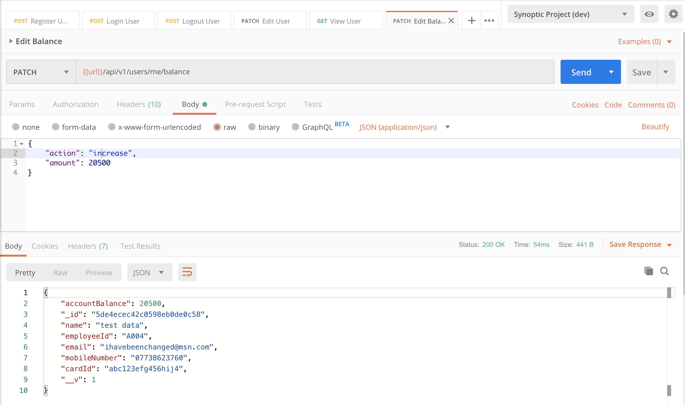

## Testing
Currently only tests for the backend API component have been developed.
From within the server directory run:

```bash
npm run test
```

Tests written using the [Jest](https://jestjs.io/) framework.

| Test number | Test Description | Expected Outcome | Pass / Fail |
|-------------|------------------|------------------|-------------|
|1|Should log in existing user|status(200), welcome message|Pass|
|2|Should create a new user|status(201), user object|Pass|
|3|Authorized user can edit account details|status(200), user object|Pass|
|4|Authorized user cannot edit protected account details|status(400), error message|Pass|
|5|Authorized user can top up accountBalance|status(200), user object|Pass|
|6|Authorized user cannot decrease accountBalance below 0|status(400), error message|Pass|
|7|Should not create a user with an existing employeeId|status(400), error message|Pass|
|8|Should not create a user with an existing cardId|status(400), error message|Pass|
|9|Should return vague error for correct cardId and incorrect pin|status(400), error message|Pass|
|10|Should return card not registered error for incorrect cardId|status(400), error message|Pass|
|11|Should logout an authorized user|status(200), goodbye message|Pass|
|12|Should return error for logout req with an unauthorized user|status(401), error message|Pass|

During the development process I used [Postman](https://www.getpostman.com/) for manual testing of my API and to guide the design process and for debugging.

I have included some screenshots of the various requests and responses as seen in the [Postman](https://www.getpostman.com/) utility.

### New User Creation

### New User Creation Fail - Non unique employeeId of cardId


### Validation Error on New User Creation

### Login Success

### Login Attempt with Non-registered Card

### Login Attempt with Incorrect PIN

### View Account Details

### Edit Account Details

### Top Up Account Balance

### Insufficient Funds Spend Request

### Unauthenticated Route

### Logout Success

